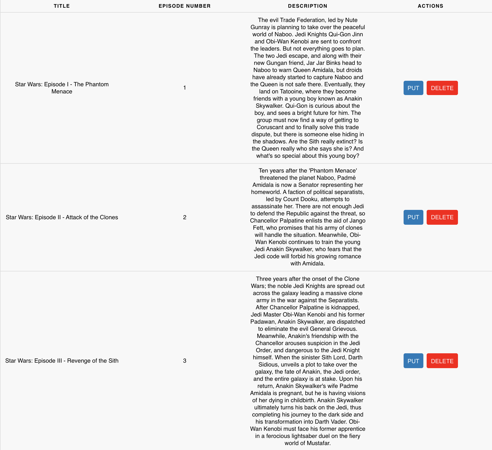

# API Calls

## User story

As an User I want to watch a table with all the Star Wars movies. Only the good ones, not the last three... :)

Also I want to update the title of each movie and delete the movie.

## Detailed description

You need to generate one table with all the movies info that we receive from the BE (GET):

If we click in the PUT button (PUT) of each movie, the title of the movie must be updated to "Put clicked" in the BE and show the updated data (GET).

If we click in the button (DELETE) of each movie, the title of the movie must be deleted in the BE and show the updated data (GET).

## Acceptance Criteria

- Fulfill the detailed description.
- Create a service in the App for the BE request.
- Use Hooks :).

## Not in the scope but recommended

- Atom Design
- Test
